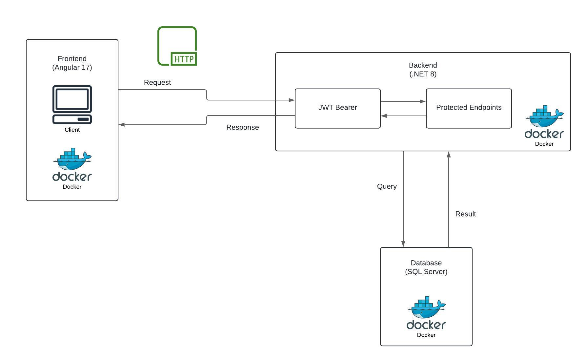

# Sistema de gestión de tareas

Este proyecto es un sistema de gestión de tareas que incluye una API en .NET para el backend, una interfaz en Angular para el frontend, y una base de datos en SQL Server. Todo el proyecto está configurado para ejecutarse con contenedores Docker.

## Tabla de Contenidos
1. [Descripción](#descripción)
2. [Pre-requisitos](#pre-requisitos)
3. [Instalación](#instalación)
4. [Ejecución](#ejecución)
5. [Acceso a la Aplicación](#acceso-a-la-aplicación)
6. [Tecnologías](#tecnologías)
7. [Documentación Técnica](#documentación-técnica)


## Descripción

El sistema permite la gestión básica de tareas, que incluye las siguientes funcionalidades:

- Crear, leer, actualizar y eliminar tareas y estados.
- API con seguridad JWT.
- Interfaz de usuario para visualizar y gestionar las tareas.
- Despliegue automatizado utilizando Docker.


## Pre-requisitos

Para ejecutar este proyecto, usaremos Docker. Asegúrese de tener Docker instalado en su máquina. Puede descargar Docker Desktop desde [aquí](https://www.docker.com/products/docker-desktop).

## Instalación

### 1. Clonar el Repositorio

Abra la terminal o el símbolo del sistema y ejecute el siguiente comando:

```bash
git clone https://github.com/Milton090/tasks-management-fullstack.git
```

### 2. Configurar el Archivo `.env` (Opcional)

Si desea configurar variables de específicas para su entorno, puede hacerlo creando un archivo `.env` en la raíz del proyecto.

1. Navegue a la raíz del proyecto en su terminal o símbolo del sistema
    
    ```bash
    cd pdfSystem
    ```

2. Cree un archivo `.env` en la raíz del proyecto:

    #### Linux/macOS:

    ```bash
    touch .env
    ```

    #### Windows (PowerShell):

    ```powershell
    New-Item -Path .env -ItemType File
    ```

    #### Windows (CMD):

    ```cmd
    echo.> .env
    ```

3. Abra el archivo `.env` en su editor de texto y agregue las variables de entorno congifurables necesarias. Estas son las que puede incluir:

    ```env
    CLIENT_PORT=7000

    SERVER_PORT=5010
    JWT_SECRET=yourV3ryStr0ngJWT_S3cr3tK3yW1th32Chars!

    DB_PORT=6060
    SA_PASSWORD=yourSAPassword123!
    ```

    - SA_PASSWORD: Debe tener al menos 8 caracteres y contener al menos un número, una letra mayúscula, una letra minúscula y un carácter especial.
    - JWT_SECRET: Debe tener al menos 32 caracteres, esto debido al algoritmo de encriptación utilizado.

> **Nota:** Si no configura el archivo `.env`, se utilizarán los valores predeterminados del archivo `docker-compose.yml`. Solo modifique el archivo `.env` si desea cambiar los valores predeterminados en caso de que haya conflictos de puertos en su máquina. Por ejemplo, si ya tiene una instancia de SQL Server en ejecución en su máquina.

> **Importante:** Si configura o cambia la variable `SERVER_PORT` en el archivo `.env`, asegúrese de cambiar la variable `apiUrl` en el archivo `environment.ts` que se encuentra en el directorio `frontend/src/app/environment/` para que coincida con el puerto del servidor.

## Ejecución

Para ejecutar el proyecto, abra la terminal o el símbolo del sistema en la raíz del proyecto y ejecute el siguiente comando:

```bash
docker compose up
```
Este comando creará y ejecutará los contenedores de Docker para la aplicación web, la API y la base de datos. Puede tardar unos minutos en completarse la primera vez que se ejecuta.

>**Nota:** Si despues de ejecutar el comando decide hacer cambios en el código, deberá detener los contenedores con el comando `docker compose down` y ejecutar `docker compose up --build` para aplicar los cambios.


## Acceso a la Aplicación
- **Frontend**: Visite `http://localhost:CLIENT_PORT/` (por defecto `7000`).
- **Backend API**: Pruebe la API en `http://localhost:SERVER_PORT/swagger/index.html` (por defecto `5010`).

Para poder consumir la API directamente en Swagger, deberá autenticarse. Una vez que haya iniciado sesion, la API devuelve un token de acceso que debe ser incluido en el encabezado de autorización de las solicitudes. Para hacer esto, haga clic en el botón `Authorize` en la parte superior derecha de la página de Swagger, y pegue el token de acceso en el campo `Value` con el prefijo `Bearer` asi: `Bearer your_access_token`.


## Tecnologías

- **Frontend**: Angular 17
- **Backend**: .NET 8
- **ORM**: Dapper
- **Base de datos**: SQL Server
- **Contenedores**: Docker


## Documentación Técnica
### Servicio de Inicialización de Base de Datos (DbInitializer)

El proyecto incluye un servicio llamado `DbInitializer`, ubicado en el directorio `Helpers/DbInitializer.cs`. Este servicio se encarga de crear automáticamente la base de datos `TaskManagement` y sus tablas asociadas (`Auth`, `State`, y `Task`) si no existen, lo que facilita el proceso de despliegue y evita tener que crearlas manualmente.

El servicio se invoca automáticamente desde `Program.cs` al iniciar la aplicación, lo que garantiza que la base de datos esté lista antes de comenzar a procesar solicitudes. De esta manera, al levantar el contenedor Docker, la aplicación creará de manera automática la estructura de la base de datos, garantizando que el sistema esté preparado para recibir solicitudes de la API y gestionar las tareas desde la interfaz de usuario.

Con esta configuración, se simplifica el despliegue y se asegura que el entorno esté correctamente configurado en cada nueva instancia del sistema, eliminando la necesidad de pasos manuales.


### Diagrama de Arquitectura

El siguiente diagrama muestra la arquitectura general de la aplicación, incluyendo los componentes principales y cómo interactúan entre sí:




